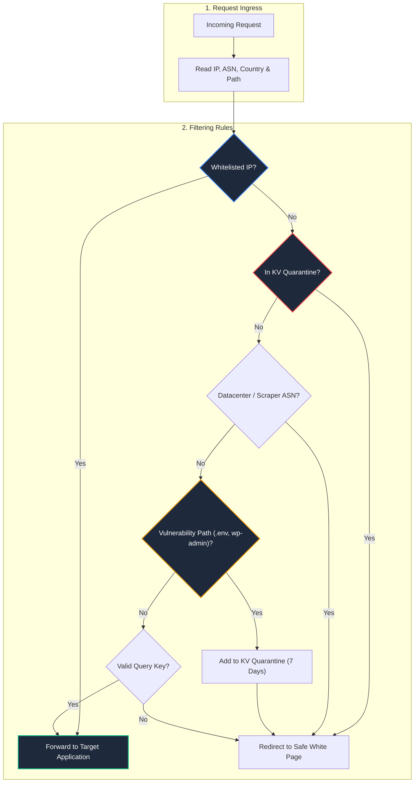

# 🛡️ Edge Traffic Cloaker & Smart Router

<div align="center">

[](https://github.com/coutinhoicaro/edge-traffic-cloaker-router)
[](https://workers.cloudflare.com/)
[](https://github.com/coutinhoicaro/edge-traffic-cloaker-router)
[](https://developers.cloudflare.com/kv/)
[](LICENSE)

<br>

**Serverless Edge Traffic Routing & Anti-Bot Protection**  
*A lightweight Cloudflare Worker that filters datacenter scrapers, blocks vulnerability probes, and routes clean traffic at the edge before it hits your origin server.*

</div>

---

## 📌 Overview

Automated bots, scrapers, and scanners consume origin server resources and generate useless traffic. 

This project demonstrates an **edge filtering architecture**:
* Runs on **Cloudflare Workers** (<15ms response time) across worldwide edge locations.
* Blocks datacenter IPs (like AWS, Hetzner, DigitalOcean) and automated scanning tools.
* Dynamically quarantines suspicious IPs in **Cloudflare KV** for 7 days.
* Silently redirects unwanted traffic to a safe white page while allowing legitimate users through.

---

## 🏗️ Traffic Decision Flow



---

## 🛡️ What It Filters

* **Datacenter Scrapers:** Instantly identifies traffic originating from server providers (AWS, OVH, Hetzner, DigitalOcean) using ASN checks.
* **Vulnerability Scanners:** Flags requests attempting to access sensitive paths like `/.env`, `/wp-login.php`, or `/admin` and puts the IP in temporary quarantine.
* **Non-Blocking Telemetry:** Uses `ctx.waitUntil` so security alert webhooks are sent in the background without slowing down real user responses.

---

## 📂 Repository Structure

```
edge-traffic-cloaker-router/
├── src/
│   └── worker.js           # Cloudflare Worker Filtering Logic & KV Handlers
├── package.json            # Node.js Config
├── wrangler.toml           # Worker Configuration Sample
├── LICENSE                 # MIT License
└── README.md               # Architecture Overview
```

> **Note:** This repository is an **architectural reference implementation**. Production IP lists, domain configurations, and webhook secrets are managed in private environment variables.

---

## 📄 License
Distributed under the **MIT License**. See `LICENSE` for details.
