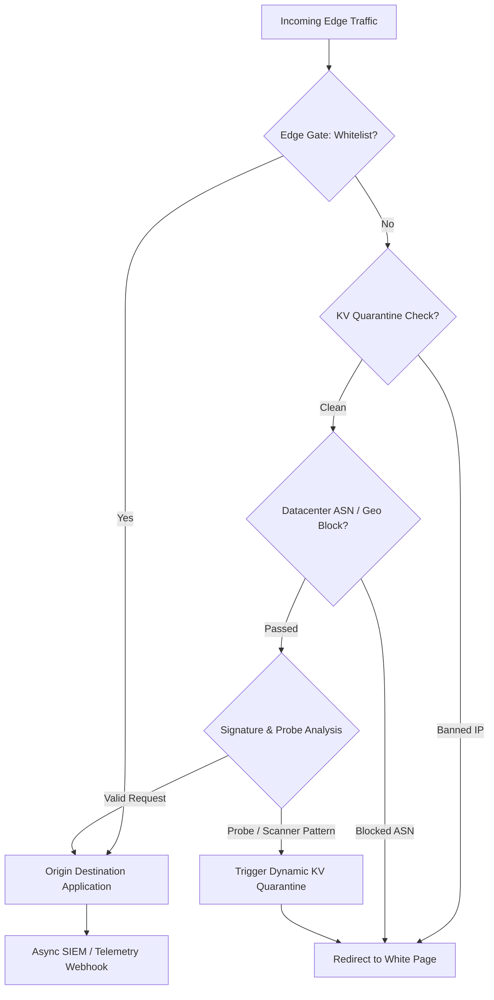

# 🛡️ Edge Traffic Cloaker & Smart Router

<div align="center">
  
  
  
  
</div>

<br>

A high-performance, serverless edge-routing and anti-bot mitigation engine running on **Cloudflare Workers (V8 Isolates)**. Designed to protect origin servers, filter malicious crawlers/scrapers at the edge with sub-15ms latency, and dynamically quarantine suspicious actors via Cloudflare KV.

---

## 🏗️ Architecture



---

## 🌟 Key Features

* **Sub-15ms Edge Decisioning:** Executed directly on Cloudflare global edge nodes.
* **Datacenter ASN Defense:** Pre-configured with major scraper/VPN ASN blocklists (AWS, Hetzner, OVH, DigitalOcean, Linode).
* **Dynamic KV Quarantine:** Automatically flags probe scanners and isolates abusive IPs for 7 days.
* **Signature-Based Cloaking:** Protects high-value routes requiring cryptographic or tokenized search parameters.
* **Fail-Safe Fallback:** Transparent HTTP 302 redirection to harmless, brand-compliant white pages.
* **Async SIEM & Alerting:** Non-blocking telemetry sent via `ctx.waitUntil` to avoid adding latency to real visitors.

---

## 🚀 Deployment

### Prerequisites
- Node.js 18+
- [Wrangler CLI](https://developers.cloudflare.com/workers/wrangler/install-and-update/)

### Configuration (`wrangler.toml`)
```toml
name = "edge-traffic-cloaker-router"
main = "src/worker.js"
compatibility_date = "2026-08-01"

kv_namespaces = [
  { binding = "QUARENTENA", id = "YOUR_KV_NAMESPACE_ID" }
]
```

### Deploy to Cloudflare Edge
```bash
npx wrangler deploy
```

---

## 📄 License
MIT License. See `LICENSE` for details.
